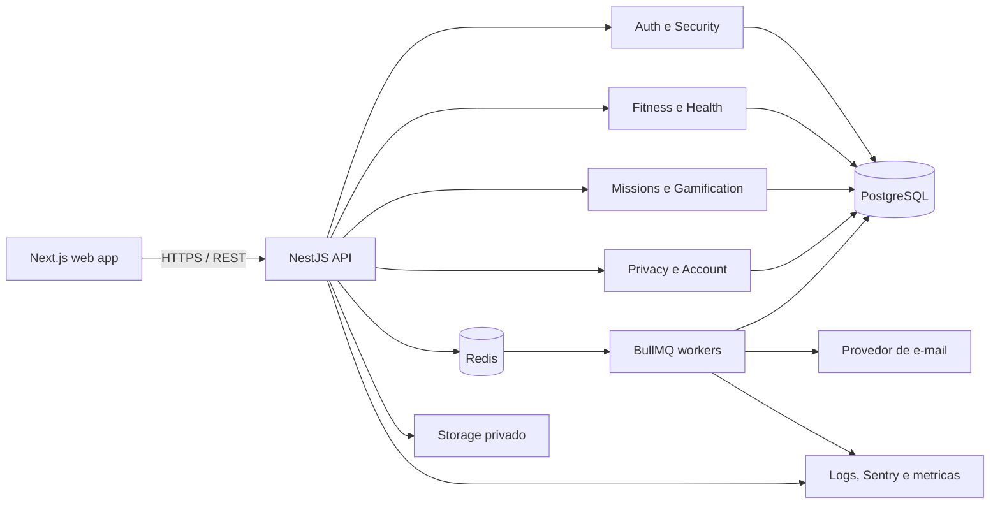

# LevelFit - Arquitetura Backend, API e Seguranca

## 1. Objetivo e decisoes principais

O backend do LevelFit deve oferecer uma API segura para identidade, treinos, alimentacao, hidratacao, gamificacao, progresso corporal e privacidade. O MVP deve ser simples de operar, mas manter limites de dominio claros para crescer sem uma reescrita precoce.

Decisoes recomendadas:

- Node.js com TypeScript e NestJS.
- Monolito modular no MVP, com modulos separados por dominio.
- REST sob o prefixo `/v1`.
- PostgreSQL como fonte de verdade e Prisma ORM para acesso tipado.
- Redis opcional para rate limit distribuido, locks curtos e BullMQ.
- Storage privado S3-compativel para fotos, usando upload direto com URL assinada.
- Access token JWT curto e refresh token opaco com rotacao.
- Cookies `HttpOnly`, `Secure` e `SameSite=Lax` para a aplicacao web.
- Jobs assincronos para e-mail, exportacao de dados, exclusao e tarefas de notificacao.

O monolito modular reduz custo operacional e ainda permite extrair workers ou servicos no futuro. Controllers nunca devem acessar Prisma diretamente: a regra de negocio fica nos services/use cases e as transacoes ficam na camada de infraestrutura.

## 2. Arquitetura geral



Fluxo de uma requisicao:

1. Proxy aplica HTTPS, limite de tamanho e protecoes basicas.
2. NestJS atribui `request_id`, configura headers e valida CORS.
3. Guard autentica o access token e carrega apenas `user_id`, `session_id` e escopos.
4. DTO valida formato, limites e enums; dados inesperados sao rejeitados.
5. Policy valida permissao e ownership do recurso.
6. Use case executa regras e transacao.
7. Eventos de dominio geram XP, auditoria ou jobs com idempotencia.
8. A resposta remove campos internos e dados nao necessarios.

## 3. Estrutura de pastas

```txt
apps/
  api/
    src/
      main.ts
      app.module.ts
      config/
      common/
        decorators/
        filters/
        guards/
        interceptors/
        pipes/
        policies/
        serializers/
      modules/
        auth/
        users/
        security/
        workouts/
        nutrition/
        hydration/
        missions/
        gamification/
        progress/
        notifications/
        privacy/
        audit/
      infrastructure/
        prisma/
        redis/
        queue/
        storage/
        mail/
        observability/
      health/
    test/
  worker/
    src/
      processors/
      schedules/
packages/
  contracts/
  config/
  test-utils/
prisma/
  schema.prisma
  migrations/
  seed.ts
```

Cada modulo deve conter `controller`, `service/use-cases`, DTOs, policy, repository interface quando houver logica complexa e testes. `packages/contracts` pode compartilhar schemas e tipos publicos com o frontend, sem compartilhar modelos Prisma.

## 4. Modulos principais

| Modulo | Responsabilidade |
|---|---|
| `auth` | Cadastro, login, refresh, logout, verificacao de e-mail, senha e MFA. |
| `users` | Perfil, preferencias e consentimentos. |
| `security` | Sessoes/dispositivos, eventos suspeitos e revogacao global. |
| `workouts` | Catalogo, plano do dia, sessoes e exercicios executados. |
| `nutrition` | Metas moderadas, refeicoes e checklist alimentar. |
| `hydration` | Meta diaria, registros e total do dia. |
| `missions` | Atribuicao diaria, progresso e conclusao. |
| `gamification` | XP, nivel, streaks e conquistas. |
| `progress` | Medidas e metadados de fotos privadas. |
| `notifications` | Preferencias, inbox e publicacao de eventos. |
| `privacy` | Consentimento, exportacao e exclusao LGPD. |
| `audit` | Registro imutavel de operacoes criticas. |

## 5. Autenticacao e autorizacao

### 5.1 Cadastro e login

- Normalizar e-mail com trim e lowercase antes da busca.
- Exigir aceite dos termos e consentimento separado para dados sensiveis antes de coletar medidas ou fotos.
- Aplicar Argon2id com parametros calibrados no ambiente de producao. O hash deve conter salt e parametros; a senha nunca deve aparecer em log, evento ou analytics.
- Respostas de login e recuperacao nao devem revelar se uma conta existe.
- Conta com e-mail nao verificado pode acessar apenas verificacao, logout e uma experiencia limitada definida pelo produto.
- Login bem-sucedido cria `sessions` e um refresh token ligado a essa sessao/dispositivo.

### 5.2 Access token

- JWT assinado com chave assimetrica e `kid` para permitir rotacao.
- Duracao recomendada: 10 minutos.
- Claims minimas: `sub`, `sid`, `iat`, `exp`, `iss`, `aud` e versao do token.
- Nao incluir e-mail, peso, metas, perfil ou qualquer dado de saude.
- Validar algoritmo, issuer, audience, expiracao e sessao nao revogada.

### 5.3 Refresh token e rotacao

- Token opaco aleatorio com pelo menos 256 bits de entropia.
- Enviar em cookie `HttpOnly; Secure; SameSite=Lax; Path=/v1/auth`.
- Guardar somente hash SHA-256/HMAC do token em `refresh_tokens`.
- A cada refresh, consumir o token atual e emitir outro da mesma familia.
- Se um token ja consumido for reutilizado, revogar toda a familia e a sessao, registrar `suspicious_login` e alertar o usuario.
- Expiracao deslizante de 30 dias, com limite absoluto de 90 dias por sessao.
- Logout local revoga a sessao atual; logout global revoga todas as sessoes e familias do usuario.

### 5.4 Autorizacao

- MVP com papeis `user`, `support_readonly` e `admin`; contas comuns recebem somente `user`.
- Autorizacao combina guard autenticado, role e ownership.
- Toda consulta de recurso privado deve filtrar `id` e `user_id` na mesma operacao.
- Recursos globais de catalogo podem ser lidos por usuarios autenticados; criacao global exige papel administrativo. No MVP, `POST /workouts` cria treino personalizado pertencente ao usuario.
- Operacoes administrativas ficam em rotas e credenciais separadas, nunca escondidas apenas pela interface.

## 6. Fluxos de seguranca da conta

### Verificacao de e-mail

- Gerar token aleatorio de uso unico, guardar somente o hash e expirar em 24 horas.
- Ao emitir um novo token, invalidar os anteriores ainda ativos.
- Confirmar e-mail e consumir token na mesma transacao.
- Limitar reenvios por conta, IP e janela de tempo.

### Recuperacao de senha

- `forgot-password` sempre retorna `202`, exista ou nao a conta.
- Token aleatorio de uso unico, hash no banco e validade de 30 minutos.
- Depois do reset, revogar todas as sessoes e refresh tokens, registrar evento e enviar alerta.
- Impedir reutilizacao do token em transacao atomica.

### MFA/2FA opcional

- Priorizar TOTP para o MVP avancado; WebAuthn e passkeys ficam para fase futura.
- Segredo TOTP deve ser criptografado com chave fora do banco.
- Gerar codigos de recuperacao de uso unico e guardar apenas seus hashes.
- Exigir senha atual e desafio TOTP para desabilitar MFA.
- A ativacao so e concluida depois da confirmacao de um codigo valido.

O schema atual precisa de uma migration com `mfa_methods`, `mfa_challenges` e `mfa_recovery_codes` antes de ativar essa funcionalidade. Ate la, os endpoints podem responder `501 FEATURE_NOT_ENABLED`.

## 7. Protecoes de aplicacao

### Rate limiting e brute force

- Aplicar limites no gateway e no NestJS.
- Chaves compostas por IP, conta normalizada, `user_id` e rota, conforme o caso.
- Login: 5 tentativas por 15 minutos por conta e 20 por 15 minutos por IP.
- Recuperacao e verificacao: 3 por hora por conta e 10 por hora por IP.
- Rotas autenticadas gerais: 120 requisicoes por minuto por usuario.
- Upload: 10 iniciacoes por hora por usuario.
- Apos falhas repetidas, usar atraso progressivo e desafio adicional; nao bloquear permanentemente a conta por acao de terceiros.

### CSRF

- Para requisicoes que usam cookie de refresh, exigir header `X-CSRF-Token` com estrategia double-submit, alem de `SameSite` e validacao de `Origin`.
- Access token preferencialmente fica apenas em memoria e e enviado em `Authorization: Bearer`.
- Nao aceitar mudancas de estado por `GET`.

### XSS e headers

- Nao armazenar HTML fornecido pelo usuario no MVP.
- Escapar conteudo no frontend e aplicar Content Security Policy estrita no app web.
- Usar Helmet, `X-Content-Type-Options: nosniff`, politica de frame, referrer policy e HSTS no edge.
- Cookies nunca ficam acessiveis a JavaScript.

### SQL injection e validacao

- Usar Prisma com parametros; SQL raw somente com APIs parametrizadas e revisao.
- `ValidationPipe` global com `whitelist: true`, `forbidNonWhitelisted: true` e transformacao controlada.
- Definir limites de tamanho, casas decimais, datas plausiveis e enums em todos os DTOs.
- Rejeitar `NaN`, infinito, UUID invalido e timestamps futuros onde nao fazem sentido.
- O backend decide XP, nivel, streak e conclusao; nunca aceita esses valores calculados pelo cliente.

### CORS e transporte

- HTTPS obrigatorio, inclusive entre proxy e API quando fora de rede privada confiavel.
- `Access-Control-Allow-Origin` com allowlist exata por ambiente; nunca `*` com credenciais.
- Permitir somente metodos e headers usados pelo app.
- Preflight com cache curto e `credentials: true` apenas quando necessario.
- Limite JSON recomendado de 256 KB; uploads de foto nao passam pelo processo da API.

## 8. Padrao da API

Base URL: `/v1`.

Convencoes:

- JSON em `camelCase`; banco em `snake_case` via mapeamento Prisma.
- Datas em ISO 8601 UTC; regras de dia usam o timezone IANA do usuario.
- IDs em UUID.
- Paginacao por cursor: `?cursor=<opaque>&limit=20`, maximo 100.
- Escritas criticas aceitam `Idempotency-Key` de 16 a 180 caracteres.
- `ETag` ou `updatedAt` pode ser usado para concorrencia otimista em preferencias.
- Nenhuma resposta devolve hash, token persistido, storage key ou metadado interno.

Envelope de sucesso para colecoes:

```json
{
  "data": [],
  "page": { "nextCursor": null, "hasMore": false }
}
```

Formato de erro:

```json
{
  "error": {
    "code": "VALIDATION_ERROR",
    "message": "Nao foi possivel concluir a solicitacao.",
    "fields": [{ "field": "email", "code": "INVALID_FORMAT" }],
    "requestId": "req_..."
  }
}
```

Codigos comuns: `400 VALIDATION_ERROR`, `401 UNAUTHENTICATED`, `403 FORBIDDEN`, `404 NOT_FOUND`, `409 CONFLICT`, `410 TOKEN_EXPIRED`, `413 PAYLOAD_TOO_LARGE`, `422 BUSINESS_RULE_VIOLATION`, `429 RATE_LIMITED` e `500 INTERNAL_ERROR`.

## 9. Contratos dos endpoints

Nos contratos abaixo, `auth` significa access token valido e sessao ativa. Toda rota autenticada filtra por `user_id`, registra `request_id` e devolve `429` quando excede o limite. Erros `400`, `401`, `403` e `500` seguem o padrao comum e aparecem abaixo apenas quando ha uma regra especifica.

### 9.1 Auth

#### `POST /v1/auth/register`

- Payload: `email`, `password`, `displayName`, `termsAccepted: true`, `sensitiveDataConsent: boolean`, `timezone` IANA.
- Resposta: `201` com `user { id, email, emailVerified }` e `verificationRequired: true`.
- Validacao: e-mail valido e ate 254 chars; senha de 10 a 128 chars; nome de 2 a 80; timezone valido; aceite obrigatorio.
- Permissao: publica.
- Erros: `409 EMAIL_UNAVAILABLE`; a mensagem externa pode ser neutra para reduzir enumeracao.
- Rate limit: 5/h por IP e 3/h por e-mail.
- Seguranca: Argon2id, token de verificacao hasheado, auditoria do aceite e e-mail em job.

#### `POST /v1/auth/login`

- Payload: `email`, `password`, `deviceName?`, `rememberMe?`.
- Resposta: `200` com `accessToken`, `expiresIn`, perfil minimo; refresh token em cookie seguro.
- Validacao: limites de e-mail/senha; `deviceName` ate 160 chars.
- Permissao: publica.
- Erros: `401 INVALID_CREDENTIALS`, `403 ACCOUNT_SUSPENDED`, `403 EMAIL_VERIFICATION_REQUIRED`, `423 CHALLENGE_REQUIRED`.
- Rate limit: 5/15 min por conta e 20/15 min por IP.
- Seguranca: comparacao resistente a timing, sessao por dispositivo, deteccao de IP/UA incomum e evento de seguranca.

#### `POST /v1/auth/logout`

- Payload: vazio; opcional `allDevices: false` somente para compatibilidade. Logout global deve preferir endpoint explicito futuro.
- Resposta: `204`; limpa o cookie.
- Validacao: CSRF e Origin quando o refresh cookie estiver presente.
- Permissao: sessao atual; deve ser idempotente.
- Erros: nenhum detalhe sobre token ausente.
- Rate limit: 20/min por usuario/IP.
- Seguranca: revoga refresh family e sessao local; se `allDevices=true`, revoga todas e cria evento `sessions_revoked`.

#### `POST /v1/auth/refresh`

- Payload: refresh cookie e header `X-CSRF-Token`.
- Resposta: `200` com novo `accessToken`, `expiresIn` e novo refresh cookie.
- Validacao: cookie, CSRF, Origin, expiracao e familia do token.
- Permissao: refresh token valido.
- Erros: `401 INVALID_REFRESH_TOKEN`, `401 SESSION_REVOKED`, `409 TOKEN_REUSE_DETECTED`.
- Rate limit: 30/15 min por sessao e 60/15 min por IP.
- Seguranca: rotacao atomica; reuse detection revoga a familia inteira.

#### `POST /v1/auth/forgot-password`

- Payload: `email`.
- Resposta: sempre `202` com mensagem neutra.
- Validacao: formato e tamanho do e-mail.
- Permissao: publica.
- Erros: apenas validacao e limite; falha de provedor nao revela existencia.
- Rate limit: 3/h por conta e 10/h por IP.
- Seguranca: token hasheado, validade de 30 min, job idempotente e assunto sem dados sensiveis.

#### `POST /v1/auth/reset-password`

- Payload: `token`, `newPassword`.
- Resposta: `204`.
- Validacao: token opaco com tamanho esperado; senha de 10 a 128 chars.
- Permissao: token valido, nao usado e nao expirado.
- Erros: `410 INVALID_OR_EXPIRED_TOKEN`, `422 PASSWORD_REJECTED`.
- Rate limit: 5/h por IP e token hash.
- Seguranca: consumo atomico, Argon2id, revogacao global, alerta e auditoria.

#### `POST /v1/auth/verify-email`

- Payload: `token`.
- Resposta: `200` com `emailVerified: true`.
- Validacao: formato e tamanho do token.
- Permissao: token valido, nao usado e nao expirado.
- Erros: `410 INVALID_OR_EXPIRED_TOKEN`, `409 EMAIL_ALREADY_VERIFIED`.
- Rate limit: 10/h por IP.
- Seguranca: hash e consumo atomico; nao colocar o token em logs ou analytics.

#### `POST /v1/auth/enable-2fa`

- Payload fase 1: `password`; fase 2: `challengeId`, `totpCode`.
- Resposta: fase 1 `200` com QR/secret temporario; fase 2 `200` com recovery codes exibidos uma vez.
- Validacao: senha atual; TOTP de 6 digitos; challenge ate 10 min.
- Permissao: auth recente, e-mail verificado.
- Erros: `401 REAUTHENTICATION_REQUIRED`, `422 INVALID_TOTP`, `409 MFA_ALREADY_ENABLED`, `501 FEATURE_NOT_ENABLED`.
- Rate limit: 5/15 min por usuario.
- Seguranca: segredo criptografado, recovery codes hasheados e evento `two_factor_enabled`.

#### `POST /v1/auth/disable-2fa`

- Payload: `password`, `totpCode` ou `recoveryCode`.
- Resposta: `204`.
- Validacao: reautenticacao e segundo fator valido.
- Permissao: auth recente e MFA ativo.
- Erros: `401 REAUTHENTICATION_REQUIRED`, `422 INVALID_MFA_CODE`, `409 MFA_NOT_ENABLED`, `501 FEATURE_NOT_ENABLED`.
- Rate limit: 5/15 min por usuario.
- Seguranca: revoga metodos/codigos, gira sessoes e envia alerta.

### 9.2 Usuario e privacidade

#### `GET /v1/me`

- Payload: nenhum.
- Resposta: `200` com conta, perfil, preferencias, consentimentos e resumo do nivel; sem campos secretos.
- Validacao: auth.
- Permissao: proprio usuario.
- Erros: `404 USER_NOT_FOUND` somente para conta deletada/inconsistente.
- Rate limit: 120/min por usuario.
- Seguranca: `Cache-Control: private, no-store` e minimizacao de dados.

#### `PATCH /v1/me`

- Payload: subconjunto de `displayName`, `timezone`, `fitnessGoal`, `activityLevel`, `heightCm`, `rankingOptIn`, preferencias.
- Resposta: `200` com perfil atualizado e `updatedAt`.
- Validacao: allowlist; altura de 80 a 250 cm; enums; timezone IANA; nenhum campo de sistema.
- Permissao: proprio usuario.
- Erros: `409 VERSION_CONFLICT`, `422 CONSENT_REQUIRED` para dados sensiveis.
- Rate limit: 30/min por usuario.
- Seguranca: mudancas de e-mail/senha usam fluxos dedicados; auditar consentimento e ranking opt-in.

#### `DELETE /v1/me`

- Payload: `password`, `confirmation: "EXCLUIR"`, `reason?` e segundo fator quando ativo.
- Resposta: `202` com `deletionRequestId` e prazo operacional.
- Validacao: reautenticacao, confirmacao exata e motivo ate 500 chars.
- Permissao: proprio usuario com auth recente.
- Erros: `401 REAUTHENTICATION_REQUIRED`, `409 DELETION_ALREADY_REQUESTED`.
- Rate limit: 3/dia por usuario.
- Seguranca: revoga sessoes, inicia job auditavel, remove fotos do storage e respeita retencoes legais sem manter dados de saude desnecessarios.

#### `GET /v1/me/security-events`

- Payload: query `cursor`, `limit` de 1 a 100 e `type?`.
- Resposta: `200` paginado com tipo, data, dispositivo aproximado e localizacao grosseira quando disponivel.
- Validacao: cursor opaco, enum e limite.
- Permissao: proprio usuario.
- Erros: `400 INVALID_CURSOR`.
- Rate limit: 30/min por usuario.
- Seguranca: mascarar IP e user-agent; nunca devolver metadata interna completa.

#### `POST /v1/me/export-data`

- Payload: `format: "json"`, `includeProgressPhotos: boolean`.
- Resposta: `202` com `exportRequestId`, `status: "queued"`.
- Validacao: formato suportado e reautenticacao quando inclui fotos.
- Permissao: proprio usuario, e-mail verificado.
- Erros: `409 EXPORT_ALREADY_PENDING`, `401 REAUTHENTICATION_REQUIRED`.
- Rate limit: 2/7 dias por usuario.
- Seguranca: job gera arquivo criptografado, URL assinada de curta duracao, alerta por e-mail e exclusao automatica do arquivo.

### 9.3 Treino

#### `GET /v1/workouts`

- Payload: query `cursor`, `limit`, `category?`, `difficulty?`, `durationMax?`.
- Resposta: `200` paginado com catalogo e treinos personalizados do usuario.
- Validacao: enums; duracao de 5 a 240 min; limite maximo 100.
- Permissao: auth; somente itens globais publicados ou pertencentes ao usuario.
- Erros: `400 INVALID_FILTER`.
- Rate limit: 120/min por usuario.
- Seguranca: filtros aplicados no servidor; nao expor autoria privada de terceiros.

#### `POST /v1/workouts`

- Payload: `name`, `description?`, `category`, `difficulty`, `estimatedDurationMinutes`, lista de exercicios com ordem, series, repeticoes/duracao e descanso.
- Resposta: `201` com treino personalizado criado.
- Validacao: nome 2-120; ate 50 exercicios; valores dentro de limites seguros; IDs existentes.
- Permissao: auth; cria somente recurso do proprio usuario.
- Erros: `404 EXERCISE_NOT_FOUND`, `422 UNSAFE_WORKOUT_CONFIGURATION`.
- Rate limit: 20/h por usuario.
- Seguranca: transacao; nao conceder XP na criacao; avisos de seguranca nao equivalem a prescricao medica.

#### `GET /v1/workouts/today`

- Payload: query opcional `date` no fuso do usuario.
- Resposta: `200` com treino planejado, status e alternativas leves/recuperacao; `204` se nenhum estiver previsto.
- Validacao: data entre 30 dias passados e 7 futuros.
- Permissao: auth; proprio plano.
- Erros: `400 INVALID_DATE`.
- Rate limit: 120/min por usuario.
- Seguranca: nao sugerir compensacao extrema por treino perdido; considerar descanso e sessoes recentes.

#### `POST /v1/workout-sessions`

- Payload: `workoutId`, `startedAt?`, `idempotencyKey` no header.
- Resposta: `201` com sessao `in_progress` e exercicios copiados como snapshot.
- Validacao: treino acessivel; horario plausivel; chave idempotente obrigatoria.
- Permissao: auth; proprio usuario.
- Erros: `404 WORKOUT_NOT_FOUND`, `409 SESSION_ALREADY_STARTED`.
- Rate limit: 20/h por usuario.
- Seguranca: nao confiar em XP do cliente; idempotencia evita sessoes duplicadas.

#### `PATCH /v1/workout-sessions/:id`

- Payload: `status`, `completedAt?`, `durationMinutes?`, `perceivedEffort?`, `notes?`, atualizacoes de exercicios.
- Resposta: `200` com sessao, resumo e efeitos de gamificacao calculados.
- Validacao: transicoes permitidas; esforco 1-10; notas ate 1000; duracao 1-360; sem conclusao futura.
- Permissao: auth e ownership.
- Erros: `404 SESSION_NOT_FOUND`, `409 INVALID_STATUS_TRANSITION`, `422 UNSAFE_OR_IMPLAUSIBLE_VALUES`.
- Rate limit: 60/h por usuario.
- Seguranca: conclusao, XP e missao na mesma transacao/outbox; repeticao da requisicao nao duplica XP.

### 9.4 Alimentacao

#### `GET /v1/nutrition/goals`

- Payload: query opcional `date`.
- Resposta: `200` com metas ativas, checklist e aviso de que sao metas gerais, nao prescricao clinica.
- Validacao: data plausivel.
- Permissao: auth e consentimento para dados sensiveis quando aplicavel.
- Erros: `404 GOAL_NOT_CONFIGURED`.
- Rate limit: 120/min por usuario.
- Seguranca: nao retornar metas de terceiros; `no-store`; evitar linguagem de dieta extrema.

#### `POST /v1/food-logs`

- Payload: `mealId?`, `mealType`, `loggedAt`, `description?`, `calories?`, `proteinGrams?`, `carbsGrams?`, `fatGrams?`, `checklistItems?`.
- Resposta: `201` com registro e progresso diario recalculado.
- Validacao: data plausivel; descricao ate 500; macros/calorias opcionais e nao negativos; limites superiores anti-erro.
- Permissao: auth, ownership e consentimento sensivel.
- Erros: `404 MEAL_NOT_FOUND`, `422 IMPLAUSIBLE_NUTRITION_VALUE`.
- Rate limit: 100/dia por usuario.
- Seguranca: idempotency key recomendada; nao gerar culpa nem XP proporcional a restricao calorica.

#### `GET /v1/food-logs/today`

- Payload: query opcional `date`.
- Resposta: `200` com registros do dia, checklist e totais; nao classificar alimento como moralmente bom/ruim.
- Validacao: data no intervalo permitido.
- Permissao: auth e ownership.
- Erros: `400 INVALID_DATE`.
- Rate limit: 120/min por usuario.
- Seguranca: `Cache-Control: private, no-store`; timezone do usuario define o dia.

### 9.5 Hidratacao

#### `GET /v1/hydration/today`

- Payload: query opcional `date`.
- Resposta: `200` com `goalMl`, `consumedMl`, percentual limitado visualmente e registros.
- Validacao: data plausivel.
- Permissao: auth e ownership.
- Erros: `404 HYDRATION_GOAL_NOT_CONFIGURED` apenas quando onboarding incompleto.
- Rate limit: 120/min por usuario.
- Seguranca: meta conservadora e configuravel; nao apresentar recomendacao como orientacao medica individual.

#### `POST /v1/water-logs`

- Payload: `amountMl`, `loggedAt?`, `source?`; `Idempotency-Key` recomendado.
- Resposta: `201` com registro, total diario e missao atualizada.
- Validacao: 25 a 2000 ml por registro; horario plausivel; maximo diario anti-erro configuravel, sem bloquear correcao consciente.
- Permissao: auth e ownership.
- Erros: `422 IMPLAUSIBLE_WATER_AMOUNT`, `409 DUPLICATE_REQUEST`.
- Rate limit: 120/dia por usuario.
- Seguranca: transacao idempotente; cliente nao envia XP nem percentual.

### 9.6 Gamificacao

#### `GET /v1/missions/today`

- Payload: query opcional `date`.
- Resposta: `200` com missoes, progresso, XP potencial e alternativas de recuperacao.
- Validacao: data atual ou historica curta; timezone do perfil.
- Permissao: auth e ownership.
- Erros: `409 ONBOARDING_INCOMPLETE` quando faltam preferencias essenciais.
- Rate limit: 120/min por usuario.
- Seguranca: gerar no servidor; nao usar streak para pressionar treino em dia de recuperacao.

#### `PATCH /v1/missions/:id/complete`

- Payload: `evidenceType?`, `sourceId?`; `Idempotency-Key` obrigatoria quando nao houver origem unica.
- Resposta: `200` com missao, XP concedido, nivel e conquistas novas.
- Validacao: missao do dia, criterios atendidos e origem valida.
- Permissao: auth e ownership.
- Erros: `404 MISSION_NOT_FOUND`, `409 MISSION_ALREADY_RESOLVED`, `422 CRITERIA_NOT_MET`.
- Rate limit: 60/h por usuario.
- Seguranca: preferir conclusao automatica por eventos confiaveis; transacao e chave unica em `xp_events`.

#### `GET /v1/xp`

- Payload: query `cursor?`, `limit?`.
- Resposta: `200` com XP total, nivel, progresso e historico paginado.
- Validacao: cursor e limite.
- Permissao: auth e ownership.
- Erros: `400 INVALID_CURSOR`.
- Rate limit: 120/min por usuario.
- Seguranca: XP e derivado do ledger `xp_events`; nunca e aceito diretamente do cliente.

#### `GET /v1/streak`

- Payload: query `type?`.
- Resposta: `200` com sequencias, estado, data da ultima atividade e protecoes disponiveis.
- Validacao: enum de tipo.
- Permissao: auth e ownership.
- Erros: nenhum; conta nova recebe streak zero.
- Rate limit: 120/min por usuario.
- Seguranca: calculo pelo timezone; dias de pausa planejada e recuperacao nao devem ser tratados como fracasso.

#### `GET /v1/achievements`

- Payload: query `cursor?`, `limit?`, `category?`, `status?`.
- Resposta: `200` com catalogo, progresso e data de desbloqueio.
- Validacao: enums, cursor e limite.
- Permissao: auth; dados de desbloqueio somente do proprio usuario.
- Erros: `400 INVALID_FILTER`.
- Rate limit: 120/min por usuario.
- Seguranca: conquistas sao calculadas por eventos idempotentes; itens ocultos nao vazam criterios sensiveis.

### 9.7 Progresso corporal

#### `POST /v1/body-measurements`

- Payload: `measuredAt`, `weightKg?`, `bodyFatPercentage?`, `waistCm?`, `chestCm?`, `hipCm?`, `notes?`; `Idempotency-Key` recomendado.
- Resposta: `201` com medida criada, sem interpretacao diagnostica.
- Validacao: ao menos uma medida; ranges humanos amplos; ate 2 casas decimais; data nao futura; notas ate 500.
- Permissao: auth, ownership e consentimento explicito para dados sensiveis.
- Erros: `422 CONSENT_REQUIRED`, `422 IMPLAUSIBLE_MEASUREMENT`, `409 DUPLICATE_REQUEST`.
- Rate limit: 20/dia por usuario.
- Seguranca: `no-store`, auditoria de acesso excepcional e nenhuma medida em logs/analytics.

#### `GET /v1/body-measurements`

- Payload: query `from?`, `to?`, `cursor?`, `limit?`.
- Resposta: `200` paginado, ordenado por `measuredAt`, com unidades preferidas.
- Validacao: intervalo maximo de 5 anos por consulta; limite ate 100.
- Permissao: auth, ownership e consentimento.
- Erros: `400 INVALID_DATE_RANGE`, `422 CONSENT_REQUIRED`.
- Rate limit: 60/min por usuario.
- Seguranca: `Cache-Control: private, no-store`; conversao de unidade sem alterar o valor original.

#### `POST /v1/progress-photos`

- Payload: `contentType`, `fileSize`, `capturedAt`, `viewType?`; etapa posterior confirma `storageKey` emitida pelo servidor.
- Resposta: `201` com `photoId`, URL assinada de upload e expiracao; confirmacao retorna metadata sem URL permanente.
- Validacao: JPEG/PNG/WebP; ate 10 MB; dimensoes minimas/maximas apos processamento; data plausivel.
- Permissao: auth recente, ownership e consentimento sensivel.
- Erros: `413 FILE_TOO_LARGE`, `415 UNSUPPORTED_MEDIA_TYPE`, `422 CONSENT_REQUIRED`.
- Rate limit: 10/h e 30/dia por usuario.
- Seguranca: bucket privado, chave aleatoria, URL curta, scan/processamento, remocao de EXIF e nenhuma foto em logs ou notificacoes.

## 10. Consistencia, transacoes e idempotencia

- Concluir treino, atualizar missao e conceder XP exige uma transacao no banco.
- `xp_events.idempotency_key` deve ser unica e derivada da origem, por exemplo `workout_session:<id>:completed`.
- Para efeitos externos, usar transactional outbox: salvar evento na mesma transacao e publicar depois no worker.
- Locks devem ser curtos. Para streak e nivel, usar update atomico ou advisory lock por usuario quando necessario.
- Nao usar Redis como fonte de verdade para XP, pagamentos, consentimento ou progresso.
- Requisicoes com `Idempotency-Key` repetida e mesmo payload retornam a resposta original; mesma chave com payload diferente retorna `409 IDEMPOTENCY_KEY_REUSED`.

## 11. Erros e experiencia segura

- O filtro global converte excecoes internas no envelope padrao e nunca envia stack trace.
- Mensagens externas devem ser claras, mas nao revelar conta existente, regra antifraude ou estrutura interna.
- Erros esperados de negocio ficam em `4xx`; indisponibilidade de dependencia usa `503` com retry seguro.
- Quando uma atividade for perdida, a API oferece `skipped` ou missao de recuperacao; nunca cria XP negativo.
- Metas fisicas extremas, volume de treino implausivel ou sequencias sem descanso devem gerar orientacao moderada e, quando necessario, bloquear configuracoes perigosas.

## 12. Auditoria e monitoramento de seguranca

Registrar em `audit_logs`:

- Mudanca de senha, e-mail, MFA e consentimentos.
- Ativacao/desativacao de ranking.
- Exportacao e exclusao de conta.
- Acesso administrativo excepcional a dados do usuario.
- Alteracao de papeis, suspensao e reativacao.

Regras:

- Log de auditoria e append-only para a aplicacao.
- Guardar ator, acao, recurso, resultado, request ID, IP truncado/hasheado e metadata minima.
- Nunca registrar senha, token, segredo TOTP, medidas, foto, texto alimentar ou corpo completo da requisicao.
- Alertar para reuse de refresh token, muitas falhas de login, mudanca repentina de local/dispositivo e elevacao de privilegio.
- Integrar Sentry para excecoes com scrubbing e OpenTelemetry para traces sem payload sensivel.

## 13. Observabilidade

Metricas tecnicas:

- Latencia p50/p95/p99 e taxa de erro por rota.
- Saturacao de pool PostgreSQL e conexoes Redis.
- Jobs pendentes, idade do job mais antigo, retries e dead-letter queue.
- Logins falhos, tokens reutilizados e contas bloqueadas temporariamente.
- Taxa de sucesso de upload e processamento de fotos.

Metas iniciais:

- Disponibilidade mensal da API: 99,9%.
- p95 de leitura autenticada: menor que 400 ms, excluindo uploads e jobs.
- Erros `5xx`: menor que 0,5%.
- Toda requisicao recebe `request_id`; toda operacao assincrona recebe `correlation_id`.

## 14. Testes

- Unitarios: regras de streak, XP, transicoes de sessao, validacoes e policies.
- Integracao: Prisma com PostgreSQL real efemero; rotacao/reuse de refresh; transacoes e constraints.
- E2E: cadastro, verificacao, login, refresh, logout, treino completo, missao, exportacao e exclusao.
- Seguranca: IDOR/ownership, enumeracao, CSRF, CORS, rate limit, JWT invalido, mass assignment e upload malicioso.
- Contrato: OpenAPI validado e testes do frontend contra schemas publicados.
- Carga: login, dashboard e registro de agua nos horarios de pico.

Cobertura deve priorizar regras e riscos. Os fluxos de autenticacao, privacidade, XP e progresso sensivel nao podem depender apenas de testes manuais.

## 15. Deploy e operacao

- Containers separados para `api` e `worker` usando a mesma imagem versionada.
- PostgreSQL e Redis gerenciados; storage privado com versionamento e lifecycle.
- Secrets em secret manager, nunca no repositorio ou imagem.
- CI executa lint, typecheck, testes, geracao Prisma e verificacao de migration.
- Migration roda como job unico antes da nova versao; usar estrategia expand/migrate/contract para mudancas compativeis.
- Deploy rolling ou blue/green com health checks de liveness e readiness.
- Backup PostgreSQL com PITR, teste de restauracao periodico e RPO/RTO documentados.
- Ambientes isolados, dados sinteticos fora de producao e acesso administrativo com MFA.
- HTTPS, HSTS e rotacao de chaves planejada desde o primeiro deploy.

## 16. Lacunas do schema antes da implementacao

O schema Prisma atual cobre o nucleo do MVP. Antes de implementar todos os fluxos acima, adicionar migrations para:

- `workouts.owner_user_id` ou tabela equivalente para treinos personalizados.
- `mfa_methods`, `mfa_challenges` e `mfa_recovery_codes` quando MFA for ativado.
- `data_export_requests` e `account_deletion_requests` para rastrear direitos LGPD.
- `idempotency_records` para chaves genericas fora de `xp_events`.
- `outbox_events` para publicacao confiavel de e-mails, conquistas e notificacoes.
- Campo de versao ou `updated_at` obrigatorio em recursos com concorrencia otimista.

Essas adicoes devem ser feitas por migrations incrementais, sem editar migrations ja aplicadas.

## 17. Escopo seguro recomendado para o MVP

Implementar no primeiro corte:

- Cadastro, verificacao, login, refresh rotativo, logout local/global e recuperacao de senha.
- Perfil, consentimento, preferencias, exportacao e solicitacao de exclusao.
- Catalogo de treino, sessao, alimentacao em checklist, hidratacao e medidas.
- Missoes, XP, nivel, streak acolhedor e conquistas essenciais.
- Inbox interna e e-mails transacionais em worker.
- Auditoria, rate limiting, logs estruturados, Sentry e backups.

Adiar sem comprometer a arquitetura:

- MFA TOTP, passkeys, login social e painel administrativo completo.
- Rankings sociais, compartilhamento, recomendacao automatica e integracoes com wearables.
- Processamento avancado de imagens e analises preditivas.

O MVP nao deve oferecer diagnostico, prescricao clinica, recomendacao de medicamento, dieta extrema ou mecanismos que recompensem overtraining. Gamificacao e um mecanismo de apoio a consistencia, nunca uma autorizacao para ultrapassar limites de saude.
