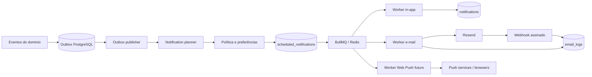

# LevelFit - Notificações, E-mail, Jobs e Retenção

## 1. Decisão recomendada para o MVP

O LevelFit deve começar com duas camadas ativas:

1. Central de notificações interna para eventos de produto e progresso.
2. E-mail para mensagens transacionais, segurança e lembretes de alto valor escolhidos pelo usuário.

Web Push entra em uma fase posterior, depois de medir a utilidade dos lembretes internos e por e-mail. O backend já deve manter contratos e tabelas preparados para push, mas a permissao do navegador não deve ser solicitada no onboarding inicial.

Stack recomendada:

- BullMQ com Redis para filas, atrasos, retries e workers.
- PostgreSQL como fonte de verdade de agendamentos e preferências.
- Resend como primeiro provedor de e-mail, isolado por uma interface `EmailProvider`.
- React Email para templates versionados no codigo.
- Web Push Protocol com VAPID e Service Worker na fase PWA.
- Sentry, logs estruturados e métricas OpenTelemetry para operacao.

Principio central: notificação e um apoio contextual, não um mecanismo de culpa. O sistema deve preferir menos mensagens, mais relevantes, e deve aceitar pausa, recaída e retorno como partes normais da jornada.

## 2. Objetivos e princípios

Objetivos:

- Ajudar o usuário a lembrar uma intencao que ele mesmo configurou.
- Tornar progresso e conquistas visiveis no momento certo.
- Reduzir abandono sem criar dependencia, ansiedade ou pressão.
- Proteger conta e comunicar eventos transacionais com confiabilidade.

Princípios de produto:

- Utilidade antes de frequencia.
- Consentimento antes de alcance.
- Contexto atual antes de agenda antiga.
- Incentivo antes de urgencia artificial.
- Uma recaída gera acolhimento e uma próxima ação pequena, nunca punição.
- Silencio e uma escolha valida do usuário.
- Dados de saúde não aparecem em superficies expostas do dispositivo.

## 3. Arquitetura em três camadas



Responsabilidades:

- Eventos de dominio dizem o que aconteceu, sem escolher canal.
- O planner decide se uma comunicacao deve existir e quando.
- A policy decide se o canal e permitido naquele momento.
- O worker revalida as condicoes imediatamente antes do envio.
- O provedor entrega; webhooks atualizam o resultado real.

## 4. Eventos de origem

Eventos internos recomendados:

- `user.registered`
- `user.email_verification_requested`
- `auth.password_reset_requested`
- `security.suspicious_login_detected`
- `workout.scheduled`
- `workout.completed`
- `water.goal_progressed`
- `water.goal_completed`
- `nutrition.checklist_progressed`
- `mission.assigned`
- `mission.completed`
- `streak.at_risk`
- `streak.saved`
- `achievement.unlocked`
- `user.inactive_detected`
- `summary.daily_ready`
- `summary.weekly_ready`

Cada evento deve ter `eventId`, `type`, `occurredAt`, `userId`, `aggregateId`, `version`, `correlationId` e payload mínimo. Nenhum payload da fila deve conter peso, medida corporal, foto, token em texto puro ou descrição alimentar livre.

## 5. Matriz de comunicacao

| Tipo | In-app | E-mail MVP | Push futuro | Prioridade | Cancelar quando |
|---|---:|---:|---:|---|---|
| Confirmação de conta | Opcional | Sim | Não | Crítica | E-mail confirmado ou token expirado. |
| Recuperação de senha | Não | Sim | Não | Crítica | Token usado, substituido ou expirado. |
| Alerta de segurança | Sim | Sim | Opcional | Crítica | Não cancelar depois do evento confirmado. |
| Treino do dia | Sim | Opt-in | Opt-in | Normal | Treino concluído, pulado ou removido. |
| Água incompleta | Sim | Não no MVP | Opt-in | Baixa | Meta atingida, intervalo encerrado ou usuário pausou. |
| Alimentação incompleta | Sim | Não por padrão | Opt-in futuro | Baixa | Checklist concluído ou dia encerrado. |
| Missão pendente | Sim | Opt-in | Opt-in | Normal | Missão concluída, pulada, substituida ou expirada. |
| Streak em risco | Sim | Opt-in | Opt-in | Alta | Atividade elegivel concluída ou protecao aplicada. |
| Conquista desbloqueada | Sim | Opt-in | Opt-in | Normal | Deduplicar pelo desbloqueio; não cancelar depois de criada. |
| Resumo diário | Sim | Não por padrão | Não | Baixa | Não gerar se não houve atividade e não há valor util. |
| Resumo semanal | Sim | Opt-in | Não | Normal | Preferência desligada antes do envio. |
| Reativação | Sim quando voltar | Opt-in | Opt-in futuro | Baixa | Usuário voltou, opt-out ou limite de campanha atingido. |

Mensagens de conta e segurança são comunicacoes de serviço e não dependem do opt-in de lembretes. Ainda assim, devem ser estritamente transacionais. Mensagens de engajamento dependem de preferência explicita e oferecem opt-out fácil.

## 6. Preferências do usuário

Campos e comportamento:

| Preferência | Regra |
|---|---|
| `emailEnabled` | Controla mensagens de produto. Não bloqueia verificação, reset ou alerta crítico de segurança. |
| `pushEnabled` | So pode ser `true` quando existir assinatura ativa e permissao do navegador. |
| `waterRemindersEnabled` | Controla lembretes de água in-app e push. |
| `workoutRemindersEnabled` | Controla treino in-app, e-mail e push. |
| `nutritionRemindersEnabled` | Controla checklist alimentar in-app e push futuro. |
| `streakRemindersEnabled` | Controla streak em risco em todos os canais de produto. |
| `weeklySummaryEnabled` | Controla resumo semanal in-app/e-mail. |
| `preferredWorkoutTime` | Horário local escolhido; padrão somente após onboarding. |
| `waterReminderIntervalMinutes` | Valores permitidos: 60, 90, 120, 180 ou 240. |
| `streakRiskTime` | Horário local entre 17:00 e 22:30. |
| `silentDays` | Dias ISO 1-7 nos quais lembretes de produto não são enviados. |
| `quietHoursStart/End` | Janela local, inclusive quando cruza meia-noite. |
| `timezone` | Identificador IANA, por exemplo `America/Sao_Paulo`. |

Defaults recomendados:

- E-mail transacional ativo.
- Lembretes de treino e streak so são ativados depois de escolha explicita no onboarding.
- Lembretes de água e alimentação desligados até o usuário definir rotina.
- Push desligado.
- Resumo semanal ativado apenas com consentimento claro.
- Horário silencioso sugerido: 22:00 a 08:00, editavel.

O schema atual usa alguns defaults mais permissivos. Antes do lançamento, ajustar os defaults por migration ou garantir que o onboarding grave escolhas explicitas antes de agendar qualquer lembrete.

## 7. Horário silencioso e dias de pausa

Regras:

- Mensagens de produto nunca são enviadas dentro do horário silencioso.
- Se o horário calculado cair no silencio, reagendar para o próximo horário permitido somente se a mensagem continuar util.
- Streak em risco não deve ser empurrado para o dia seguinte; deve ser cancelado quando perder contexto.
- Dias silenciosos bloqueiam lembretes de treino, água, alimentação, missão, streak e reativação.
- Conquistas e resumos podem esperar a próxima janela permitida.
- Recuperação de senha, verificação solicitada pelo usuário e alertas reais de segurança são enviados imediatamente.
- Mudancas de preferências cancelam ou recalculam os agendamentos pendentes em até um minuto.

Exemplo de janela que cruza meia-noite:

```txt
quietHoursStart = 22:00
quietHoursEnd   = 08:00
silencioso      = [22:00, 24:00) U [00:00, 08:00)
```

Não existe categoria de "emergencia de saúde" no LevelFit. O produto não deve usar esse argumento para ultrapassar preferências.

## 8. Timezone e horário de verao

- Armazenar instantes em UTC (`timestamptz`) e preferências de horário como hora local mais timezone IANA.
- Nunca usar apenas offset fixo, pois ele não representa mudancas de horário de verao.
- Converter horário local para UTC no momento de materializar o agendamento.
- Guardar `timezone` usado no cálculo para permitir auditoria.
- Recalcular as proximas 48 horas quando o usuário mudar timezone.
- Detectar mudanca de timezone no cliente, mas pedir confirmação antes de alterar a preferência.
- Em horário local inexistente por transicao, usar o primeiro instante valido posterior.
- Em horário duplicado, escolher a primeira ocorrencia e usar idempotência para impedir envio duplo.

O "dia" de missões e streaks usa o timezone vigente do usuário no momento do evento. Alterar timezone não deve reescrever retroativamente o histórico.

## 9. Planejamento e agendamento

### Planner diário

Um job recorrente executa a cada 15 minutos e materializa notificações para usuários cuja janela local entrou no horizonte de 24 a 48 horas. Ele não envia mensagens; apenas grava `scheduled_notifications`.

Passos:

1. Buscar usuários ativos por faixas de timezone.
2. Carregar preferências e agenda do produto.
3. Avaliar elegibilidade e horário silencioso.
4. Criar registros com `idempotency_key` unica.
5. Publicar jobs atrasados no BullMQ depois do commit.

### Eventos em tempo real

Conquistas, alertas de segurança, verificação e reset são criados a partir da outbox logo após o evento de dominio. O planner escolhe canal e cria um agendamento imediato ou futuro.

### Reconciliacao

Um job a cada cinco minutos busca `scheduled_notifications` pendentes com `scheduled_for <= now()` que não possuem job ativo conhecido. Ele republica de forma idempotente. Assim, Redis pode ser reconstruido a partir do PostgreSQL.

## 10. Filas e workers

Filas recomendadas:

- `notification-plan`: transforma eventos em agendamentos.
- `notification-in-app`: cria itens na central interna.
- `notification-email`: renderiza e envia e-mails.
- `notification-push`: reservado para PWA.
- `notification-webhook`: processa eventos de provedores.
- `notification-maintenance`: reconciliacao, expiracao e limpeza.
- `notification-dlq`: falhas que exigem analise.

Regras operacionais:

- API e workers são processos separados.
- Jobs carregam IDs, nunca objetos completos de usuário.
- Cada worker busca os dados atuais no PostgreSQL.
- Concorrencia e limite são configurados por fila.
- Jobs criticos de segurança recebem prioridade maior que lembretes.
- Graceful shutdown termina o job atual e libera locks.
- Redis não e fonte de verdade; perda da fila não pode apagar a intencao registrada.

## 11. Pipeline de envio

Antes de enviar, todo worker executa um `preflight` atomico:

1. Bloqueia logicamente ou atualiza condicionalmente o agendamento pendente.
2. Confirma que usuário e conta continuam ativos.
3. Confirma canal, consentimento e preferência atual.
4. Reavalia horário silencioso e dia de pausa.
5. Reavalia o estado do evento, por exemplo missão ainda pendente.
6. Confirma limites de frequencia e supressoes do provedor.
7. Reserva uma chave idempotente para o envio.
8. Renderiza template permitido com dados minimos.
9. Envia e registra o identificador do provedor.
10. Atualiza status e publica métrica sem conteúdo sensível.

Se a condicao não existir mais, marcar como `cancelled`; se a preferência bloquear, usar `cancelled` com `cancel_reason = preference_disabled` quando esse campo for adicionado. Cancelamento esperado não e falha.

## 12. Retry, backoff e dead-letter

Política recomendada:

| Canal/job | Tentativas | Backoff | Observacao |
|---|---:|---|---|
| In-app | 5 | Exponencial: 5s, 30s, 2m, 10m | Falhas tendem a ser internas. |
| E-mail transacional | 5 | Exponencial com jitter, até 30m | Não repetir erro permanente. |
| E-mail de produto | 3 | Exponencial com jitter, até 2h | Cancelar se perder relevancia. |
| Push | 3 | 30s, 5m, 30m | `404/410` revoga assinatura sem retry. |
| Webhook | 8 | Exponencial com jitter, até 24h | Idempotente pelo ID do evento. |

Classificacao:

- Retry: timeout, `429`, `5xx`, indisponibilidade de Redis/DB e falhas transitorias.
- Não retry: endereco suprimido, payload invalido, `401/403` por configuração, push `404/410` e template inativo.
- Respeitar `Retry-After` do provedor.
- Depois das tentativas, mover referencia para DLQ e alertar; nunca colocar corpo completo da mensagem na DLQ.

## 13. Idempotência

Formato sugerido:

```txt
<type>:<channel>:<userId>:<businessDate>:<sourceId>:v<templateVersion>
```

Exemplos:

```txt
mission_pending:email:usr_123:2026-07-14:mission_456:v2
achievement_unlocked:in_app:usr_123:-:achievement_789:v1
weekly_summary:email:usr_123:2026-W29:-:v3
```

Regras:

- `scheduled_notifications.idempotency_key` e unica.
- Job ID do BullMQ deriva do ID do agendamento.
- Chave enviada ao provedor deriva do agendamento, quando o provedor suporta idempotência.
- Webhook e deduplicado por `provider + provider_event_id`.
- Reprocessar um job concluído retorna sucesso sem novo envio.
- Alterar template não deve reenviar eventos passados automaticamente.

Filas podem entregar mais de uma vez em cenarios de falha; por isso, idempotência deve existir no banco e no provedor, não apenas no Redis.

## 14. Cancelamento automático

Eventos que cancelam agendamentos:

- `mission.completed` cancela `mission_pending` da mesma missão.
- `workout.completed/skipped/cancelled` cancela `workout_today` correspondente.
- `water.goal_completed` cancela lembretes de água restantes no dia.
- `nutrition.checklist_completed` cancela lembretes alimentares do dia.
- `streak.saved` ou atividade elegivel cancela `streak_at_risk`.
- Preferência desativada cancela todos os pendentes daquela categoria/canal.
- Conta suspensa/deletada cancela todos os envios de produto.
- Mudanca de timezone cancela e recria o horizonte futuro.

O cancelamento ocorre no PostgreSQL com update condicional `pending -> cancelled`. Remover o job atrasado do Redis e uma otimizacao; o preflight continua sendo a barreira final contra envio obsoleto.

## 15. Limites de frequencia

### Por usuário

Limites iniciais para mensagens de produto:

- No máximo 3 notificações externas por dia somando e-mail e push.
- No máximo 1 e-mail de produto por dia.
- No máximo 1 mensagem de streak por dia.
- No máximo 1 lembrete de missão por janela de 6 horas.
- Água: no máximo 6 lembretes por dia e sempre dentro do intervalo escolhido.
- Reativação: dias 3, 10 e 30; depois pausar por 60 dias.
- Conquistas múltiplas em 10 minutos devem ser agrupadas.
- Resumos substituem lembretes de baixa prioridade quando coincidem na mesma janela.

Mensagens transacionais solicitadas pelo usuário e alertas de segurança não entram no cap de produto, mas possuem limites antifraude proprios.

### Por provedor

- Token bucket distribuido no Redis por provedor e canal.
- Limite configurado abaixo da cota contratada, com margem operacional de 20%.
- Concorrencia separada para transacional e produto.
- `429` reduz dinamicamente a taxa e respeita `Retry-After`.
- Circuit breaker abre em falhas persistentes para evitar tempestade de retries.
- Fila transacional nunca deve ser bloqueada por uma campanha de reativação.

## 16. Uso das tabelas existentes

### `notifications`

Central interna. `metadata` deve conter apenas IDs de origem e dados de apresentacao não sensíveis. `action_url` deve ser rota relativa allowlisted, nunca URL arbitraria.

### `notification_preferences`

Fonte de verdade das escolhas. Atualizações devem ser auditadas e disparar reconciliacao dos agendamentos.

### `email_logs`

Registro técnico de tentativa e entrega. `recipient_hash` permite correlacao sem guardar o e-mail duplicado. O corpo renderizado não deve ser persistido.

### `push_subscriptions`

Um registro por navegador/dispositivo. Endpoint e chaves ficam criptografados; hashes servem para deduplicacao. `revoked_at` registra opt-out, expiracao ou resposta `404/410`.

### `scheduled_notifications`

Fonte de verdade do envio futuro. O payload contem IDs e variaveis não sensíveis. A mensagem final e renderizada somente no worker.

### `notification_templates`

Mantem chave, canal e versao. Templates publicados são imutaveis; uma alteracao cria nova versao.

## 17. Ajustes recomendados no schema

Antes da implementação completa, adicionar por migrations:

- `scheduled_notifications.template_key`, `template_version`, `source_type`, `source_id`, `cancel_reason`, `failure_code`, `attempt_count` e `expires_at`.
- `email_logs.scheduled_notification_id`, `delivered_at`, `bounced_at`, `complained_at` e `metadata` mínima.
- `notifications.source_type`, `source_id` e unique parcial para deduplicacao.
- `push_subscriptions.device_name`, `expires_at` e `last_success_at`.
- `notification_preferences.achievement_emails_enabled`, `mission_emails_enabled`, `reactivation_emails_enabled` e `daily_summary_enabled` para controle granular.
- `notification_provider_events` com unique `(provider, provider_event_id)` para webhooks.
- `outbox_events` para publicação transacional confiavel.

O campo `status` pode ganhar `processing` e `suppressed`, ou `suppressed` pode ser representado por cancelamento com motivo. A escolha deve ser unica em toda a aplicacao.

## 18. Templates de e-mail

Estrutura comum:

- Preheader curto.
- Logo LevelFit e titulo direto.
- Uma mensagem principal.
- Um CTA primario.
- Link alternativo em texto para fluxos transacionais.
- Preferências/opt-out nas mensagens de produto.
- Rodape com motivo do recebimento e suporte.

Templates MVP:

| Chave | Assunto sugerido | CTA | Expiracao/contexto |
|---|---|---|---|
| `verify_email` | `Confirme seu e-mail no LevelFit` | Confirmar e-mail | Link de 24h. |
| `reset_password` | `Redefina sua senha do LevelFit` | Redefinir senha | Link de 30 min. |
| `security_alert` | `Novo acesso a sua conta LevelFit` | Revisar segurança | Sem dados intimos. |
| `workout_reminder` | `Seu treino está pronto quando você estiver` | Ver treino | Cancelar se resolvido. |
| `streak_at_risk` | `Ainda da para manter seu ritmo hoje` | Ver opção leve | Sem ameaca de perda. |
| `weekly_summary` | `Sua semana no LevelFit` | Ver progresso | Agregado, sem peso no assunto. |
| `achievement_unlocked` | `Você desbloqueou uma nova conquista` | Ver conquista | Agrupar múltiplas. |
| `reactivation` | `Vamos recomecar com um passo pequeno?` | Montar um dia leve | Sem culpa ou contagem de faltas. |
| `mission_pending` | `Uma missão curta ainda cabe no seu dia` | Ver missões | Cancelar se concluída. |

Regras de copy:

- Não usar "falhou", "perdeu tudo", "corra", "último aviso" ou urgencia falsa.
- Não prometer perda de peso, ganho muscular ou prazo de resultado.
- Não recomendar medicamento, suplemento ou compensação alimentar.
- Não mencionar peso, medidas, calorias consumidas ou fotos no assunto/preheader.
- CTA de retorno deve levar a uma ação pequena e realista.

## 19. Notificações internas

Comportamento da central:

- Lista cronologica paginada, com não lidas primeiro apenas por filtro escolhido.
- Badge mostra contagem limitada, por exemplo `9+`, sem animacao insistente.
- Itens relacionados podem ser agrupados por dia ou origem.
- Marcar como lida e uma ação de interface, não um sinal de conclusao da missão.
- `actionUrl` leva para uma rota interna especifica e validada.
- Notificações expiradas podem desaparecer da caixa principal sem apagar o histórico técnico.
- Retenção sugerida: 90 dias visiveis; depois soft delete/arquivamento conforme política de dados.

Mensagens internas podem ser mais contextuais que push, mas continuam sem expor detalhes sensíveis desnecessarios.

## 20. PWA e Web Push futuro

### Fluxo de opt-in

1. Mostrar uma explicacao contextual depois que o usuário configurar ao menos um lembrete.
2. O usuário toca em `Ativar notificações`.
3. Verificar suporte a Service Worker, Push API e estado da permissao.
4. Solicitar permissao somente dentro desse gesto.
5. Registrar Service Worker e criar `PushSubscription` com chave publica VAPID.
6. Enviar endpoint e chaves ao backend por rota autenticada e protegida contra CSRF.
7. Gravar assinatura criptografada por dispositivo.

Regras:

- Não solicitar permissao na primeira visita.
- Se o usuário negar, explicar como alterar no navegador sem insistir repetidamente.
- Usar `ServiceWorkerRegistration.showNotification()` para compatibilidade mobile.
- Detectar recursos; o app continua funcional sem push.
- Cada navegador/dispositivo possui assinatura propria.
- VAPID private key fica no secret manager; a publica pode ir ao cliente.
- Push deve ter `tag` para substituir lembretes da mesma origem e evitar empilhamento.
- Clique abre apenas rota interna allowlisted.
- Payload: titulo genérico, corpo curto, route key e IDs opacos. Nunca dados de saúde.

Exemplos seguros:

- `Hora de um pouco de água?`
- `Seu treino está pronto quando você estiver.`
- `Uma missão curta ainda cabe no seu dia.`
- `Você desbloqueou uma conquista no LevelFit.`

## 21. APIs

Todas as rotas usam `/v1`, access token valido, ownership e o envelope de erros definido na arquitetura backend.

### `GET /v1/notifications`

- Query: `cursor?`, `limit?`, `unreadOnly?`, `type?`.
- Resposta: itens paginados e `unreadCount`.
- Validação: limite de 1 a 100, cursor opaco e enum valido.
- Rate limit: 120/min por usuário.
- Segurança: somente notificações do usuário, metadata filtrada e `Cache-Control: private, no-store`.

### `PATCH /v1/notifications/:id/read`

- Payload: vazio ou `read: true`.
- Resposta: `200` com `readAt`; repeticao retorna o mesmo estado.
- Validação: UUID e ownership.
- Erros: `404 NOTIFICATION_NOT_FOUND`.
- Rate limit: 120/min por usuário.
- Segurança: update por `id + user_id`; não altera a entidade de origem.

### `PATCH /v1/notifications/read-all`

- Payload: `before?` em ISO 8601 para limitar o lote.
- Resposta: `200` com `updatedCount`.
- Validação: data não futura; máximo de retenção.
- Rate limit: 10/min por usuário.
- Segurança: update em lote filtrado por usuário; operacao idempotente.

### `GET /v1/notification-preferences`

- Resposta: preferências efetivas, timezone e capacidades (`pushSupported`, `activePushSubscriptions`).
- Validação: auth.
- Rate limit: 60/min por usuário.
- Segurança: não devolver endpoint/chaves push; `no-store`.

### `PATCH /v1/notification-preferences`

- Payload: subconjunto allowlisted das preferências, com `updatedAt` para concorrencia otimista.
- Resposta: preferências atualizadas e `rescheduledCount`.
- Validação: intervalos permitidos, horário valido, dias ISO unicos, timezone IANA e combinacoes coerentes.
- Erros: `409 VERSION_CONFLICT`, `422 PUSH_SUBSCRIPTION_REQUIRED`, `422 INVALID_QUIET_HOURS`.
- Rate limit: 30/min por usuário.
- Segurança: auditoria, ownership e job idempotente de reconciliacao.

### `POST /v1/push/subscribe`

- Payload: `endpoint`, `expirationTime?`, `keys { p256dh, auth }`, `deviceName?`.
- Resposta: `201` com `subscriptionId` e estado; repeticao atualiza a assinatura existente.
- Validação: HTTPS, hosts de push permitidos/validos, tamanhos estritos e chaves base64url.
- Erros: `409 ENDPOINT_OWNED_BY_ANOTHER_ACCOUNT`, `422 INVALID_PUSH_SUBSCRIPTION`, `501 FEATURE_NOT_ENABLED`.
- Rate limit: 10/h por usuário e IP.
- Segurança: CSRF, criptografia de envelope, hash do endpoint, nunca logar payload.

### `DELETE /v1/push/unsubscribe`

- Payload: `subscriptionId` ou hash derivado do endpoint atual.
- Resposta: `204`, inclusive se já revogada.
- Validação: UUID e ownership.
- Rate limit: 20/h por usuário.
- Segurança: marca `revokedAt`, cancela push pendente e mantem outros dispositivos intactos.

### `POST /v1/emails/test-preferences`

- Payload: `type: "workout_reminder" | "weekly_summary"`.
- Resposta: `202` com `testRequestId`.
- Validação: somente templates seguros e endereco verificado.
- Erros: `409 EMAIL_NOT_VERIFIED`, `422 EMAIL_DISABLED`.
- Rate limit: 3/dia por usuário.
- Segurança: nunca permite assunto, corpo, destinatario ou URL arbitrarios; marcado como teste e auditado.

## 22. Webhooks de e-mail

- Endpoint dedicado, por exemplo `POST /v1/webhooks/resend`.
- Verificar assinatura sobre o corpo bruto antes de parsear/processar.
- Deduplicar pelo ID do evento do provedor.
- Aceitar rapidamente e processar em fila.
- Mapear `sent`, `delivered`, `delivery_delayed`, `bounced`, `complained`, `failed` e `suppressed`.
- Bounce permanente e complaint adicionam o endereco a lista de supressao de produto.
- Não confiar em `userId` vindo do webhook; correlacionar por `providerMessageId`.
- Rotacionar segredo do webhook e monitorar falhas de assinatura.

## 23. Segurança e privacidade

- Consentimento granular e opt-out com efeito rápido.
- Dados de peso, medidas, fotos, condicoes intimas e texto alimentar não entram em push, assunto, logs ou filas.
- Tokens de verificação/reset são temporários, de uso unico e hasheados no banco.
- Links autenticados comuns levam ao app e exigem sessão; links sensíveis carregam token opaco curto.
- Endpoints e chaves de push são credenciais e ficam criptografados em repouso.
- Segredos VAPID, API keys e webhook secrets ficam no secret manager.
- Logs guardam IDs, status, template, versao e codigos de erro, não o corpo renderizado.
- Analytics usa tipo/canal e resultado, sem conteúdo da mensagem.
- Exportação LGPD inclui preferências e histórico relevante; exclusão revoga assinaturas e remove agendamentos.
- Acesso de suporte e restrito, auditado e não exibe conteúdo sensível por padrão.

## 24. Métricas

Entrega:

- Agendadas, canceladas, suprimidas, enviadas, entregues e falhas por tipo/canal.
- Taxa de bounce, complaint e unsubscribe.
- Latencia entre `scheduledFor` e envio.
- Profundidade da fila, idade do job mais antigo, retries e DLQ.
- Assinaturas push ativas, expiradas e revogadas.

Produto:

- Open/click de e-mail como sinal auxiliar, respeitando privacidade e limitacoes de tracking.
- Retorno ao app em 1h/24h após mensagem, com grupo de controle.
- Conclusao da ação sugerida, não apenas clique.
- Retenção D7/D30 por preferência e exposicao.
- Opt-out e desinstalacao/perda de permissao push.
- Número medio de mensagens por usuário ativo.

Guardrails:

- Aumento de desativacao de lembretes.
- Aumento de complaint/spam.
- Queda de bem-estar reportado ou aumento de mensagens vistas como pressão.
- Frequencia acima do cap.
- Percentual de mensagens canceladas no preflight, que pode indicar planner desatualizado.

Não otimizar somente abertura ou clique. A métrica principal e ação util incremental sem piorar opt-out, complaint ou percepcao de pressão.

## 25. Testes e operacao

Testes obrigatorios:

- Unitarios para quiet hours, dias silenciosos, timezone/DST, caps, elegibilidade e copy policy.
- Integracao para outbox, idempotência, cancelamento e reconciliacao PostgreSQL/Redis.
- Contrato com o adapter de e-mail e verificação de webhook assinado.
- E2E para concluir missão antes do envio e confirmar cancelamento.
- E2E para desativar preferências e garantir que nenhum worker envie.
- Push futuro em Chrome/Edge/Firefox e Safari suportado, desktop e mobile instalavel.
- Testes de concorrencia para dois workers pegando o mesmo agendamento.
- Chaos test simples com Redis/provedor indisponivel.

Alertas operacionais:

- Fila transacional com job mais antigo acima de 2 minutos.
- Taxa de falha ou bounce acima do baseline.
- DLQ com qualquer alerta de segurança.
- Webhook sem eventos por período inesperado.
- Volume acima de 150% da previsao por tipo.
- Muitos cancelamentos por condicao já resolvida.

## 26. Roadmap de implementação

### Fase 1 - Fundacao

- Outbox, planner, `scheduled_notifications`, BullMQ e workers.
- Interface de provider e Resend.
- Templates de verificação, reset e segurança.
- Central interna e APIs de leitura.
- Preferências, quiet hours, timezone e auditoria.

### Fase 2 - Retenção responsavel

- Treino, streak, missão e resumo semanal por opt-in.
- Cancelamento automático, caps e agrupamento.
- Webhooks, métricas e experimentos com grupo de controle.
- Reativação limitada com copy acolhedora.

### Fase 3 - PWA e Web Push

- Manifest, Service Worker e instalacao.
- Opt-in contextual, VAPID e assinaturas por dispositivo.
- Worker push, expiracao/revogação e testes por navegador.
- Rollout por feature flag e monitoramento de opt-out.

### Fase 4 - Otimizacao

- Melhor horário com base apenas em padroes agregados e consentidos.
- Priorizacao para evitar competicao entre mensagens.
- Preferências mais granulares e digest inteligente.
- Segundo provedor de e-mail somente se disponibilidade/custo justificar.

## 27. Referencias de implementação

- BullMQ: retries e backoff: https://docs.bullmq.io/guide/retrying-failing-jobs
- BullMQ: delayed jobs: https://docs.bullmq.io/guide/jobs/delayed
- BullMQ: job schedulers: https://docs.bullmq.io/guide/job-schedulers
- Resend: eventos de webhook: https://resend.com/docs/webhooks/event-types
- MDN: Notifications API: https://developer.mozilla.org/en-US/docs/Web/API/Notifications_API/Using_the_Notifications_API
- MDN: Push API: https://developer.mozilla.org/en-US/docs/Web/API/Push_API

